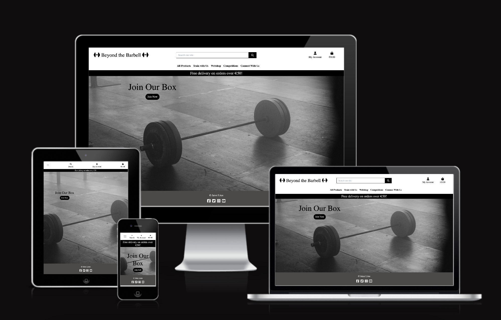
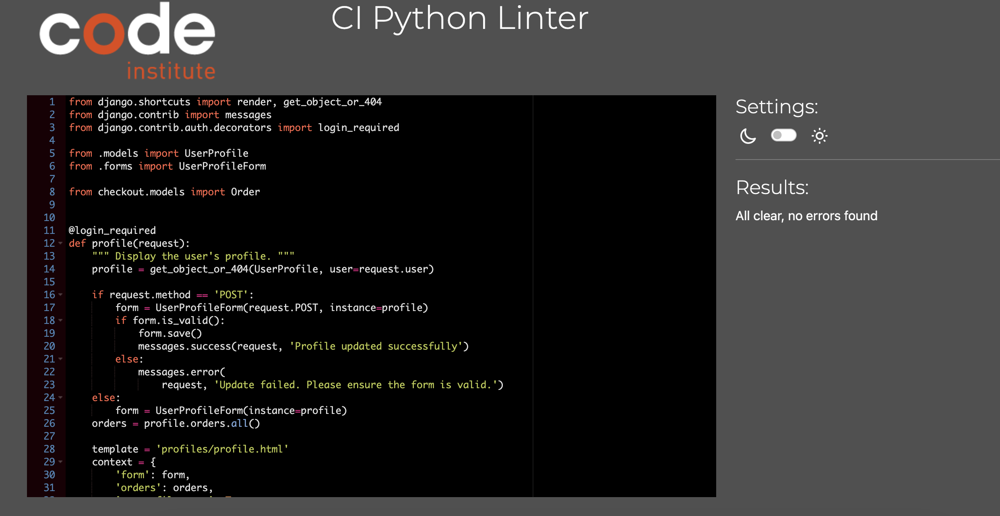
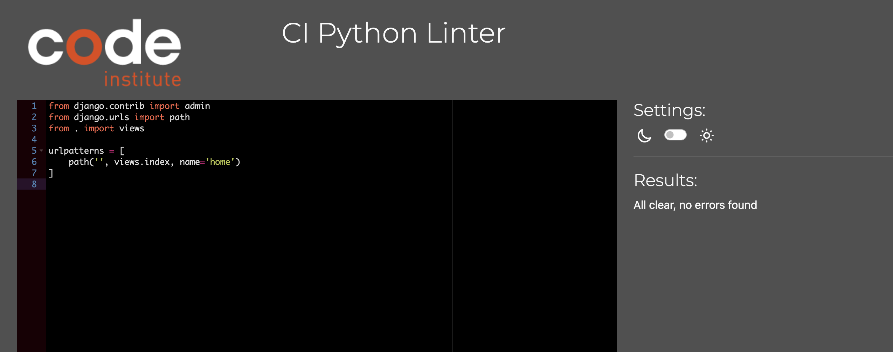
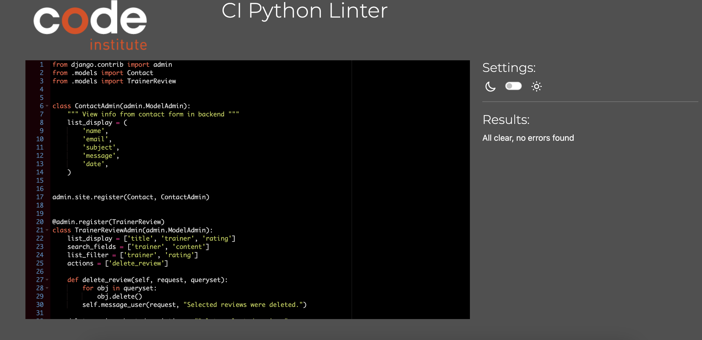
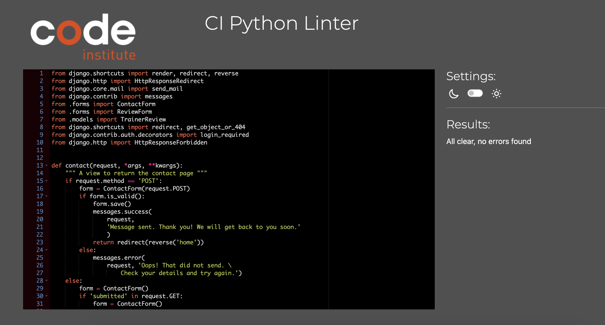

Beyond the Barbell

The deployed app: [Heroku](https://beyond-the-barbell-0789d667f147.herokuapp.com/)

GitHub Repository: [GitHub](https://github.com/Jaimilit/beyond-the-barbell)

# Table of Contents

- [Project Goals](#project-goals)
- [UX](#ux)
    - [Agile Tools](#Agile-Tools)
- [Design and Structure](#design-and-structure)
    - [Kanban Boards](#kanban-boards)
    - [Functional Structure](#functional-structure)
- [WireFrames](#Wireframes)
- [Features](#features)
    - [Navigation Bar](#navigation-bar)
    - [Pages](#pages)
- [Responsive Design](#responsive-design)
- [Future Features](#future-features)
- [Technology Used](#technology-used)
    - [Languages](#languages)
    - [Frameworks, Libraries, and Programs](#frameworks-libraries-and-programs)
    - [Database](#database)
    - [Program and Tools](#program-and-tools)
- [Testing](#testing)
    - [Bugs](#bugs)
        - [Manual Testing](#manual-testing)
        - [Browser Testing](#browser-testing)
    - [Validation](#validation)
        - [HTML Validation](#html-validation)
        - [CSS Validation](#css-validation)
        - [Python Validation](#python-validation)
        - [Lighthouse](#lighthouse)
- [Deployment](#deployment)
    - [Github](#github)
    - [Heroku](#heroku)
- [Credits](#credits)
    - [Code](#code)
    - [Content](#content)
    - [Media](#media)
    - [Inspiration](#inspiration)

# Project Goals

This project is for an e-commerce website for a hypothetical business called Beyond the Barbell.

Beyond the Barbell is a business to customer (B2C) e-commerce site, selling products to users - such as health products, clothes, and gear. Additionally, users can subscribe to the box/gym with different variations of subscriptions as well as buy personal training sessions. As a member, the user can also write reviews of personal trainers, as well as sign up for competitions offered.

Features of this business-focused website include a shopping cart, a catalogue of products, an online payment system that can save the customer’s preferred mode of payment, sign up for an email newsletter, contact us page, and private policy statement.

The site was developed using Python in the Django framework and styled using CSS and Bootstrap. ElephantSQL is used for the database and Heroku for deployment. The site is for anyone who is interested in health and fitness.

# UX

The purpose of the website is to be able to give users an opportunity to explore what is available at this particular gym.
Whether it's products or memberships, the goal is for the user to be able to browse through the site easy. The user should be able to purchase items easily, subscribe, contact us, and sign up for competitions to be part of the CrossFit community.

User stories

As a first time visitor, I want:

* To easily understand the main purpose of the site
* To be able to easily navigate through the site
* To be able to register a user account to access all content without restrictions
* To be able to view products, memberships, read reviews, contact us, & subscribe with us
* To be able to search and sort products easily
* To be able to create an account and log out of a user account
* To be able to purchase products, memberships, write reviews, contact us, & subscribe
* To be able to receive confirmation of my actions via messages
* To be able to pay via stripe service and receive free shipping if over 50 Euro
* See link to facebook page in footer
* To view custom 404 page if there is an error

Returning and frequent user goals

As a returning user, I want:

* To sign into my user account
* To be able to search and sort products easily
* To make a booking for a competition
* To view and delete my competitions
* To purchase products, view cart, & checkout
* To view orders
* Receive confirmation of my actions via messages
* Be able to make secure payments
* To view my profile
* To be able to pay via stripe service and receive free shipping if over 50 Euro
* See link to facebook page in footer
* To view custom 404 page if there is an error

Site Administrator goals

* As a Site Administrator I would like to be able to add, edit, & delete products
* As a Site Administrator I can approve reviews written prior to posting
* As a Site Administrator I can update, edit, & delete competitions

## Agile Tools

The Projects section in GitHub was used for this project. A Kanban board was used for the development of this project, which made it possible to break down the project into subtasks and make it easier to complete and track project progress. In addition, labels were used to further define the priority of each user story in the Kanban board.

The first thing I did was write the user stories I wanted my site to have. Then I created an outline in WireFrames of what I wanted my final product to look like. You can see it's not exactly the same, but the initial ideas where there.

SEO considerations implemented: meta description of content and key search words in head of code. 
Sitemap.xml was created for the site so that once ready engines like google can search it effectively.
Robots.txt file so that google could crawl the site. I have blocked off the accounts app as there is no benefit for google to crawl those pages.

# Design and Structure

The layout and design of this site was kept basic and simple. Minimal color was used to keep it simple. [Coolors](https://coolors.co/) was used for simple color choices. This website is meant to be functional and therefore I kept the color palette simple and something similiar to what you would see in an actual gym.  

Fonts chosen to be easy to read and use
Favicons used in theme of fitness
Forms use crispy templates
The image on the homepage is kept basic and dark in relation to what you actually see at the gym (at least here in Sweden - lots of dark colors!)

## Kanban Boards

[Kanban Board](https://github.com/users/Jaimilit/projects/6) was used to create this project. An MVP (Minimum Viable Product) was then designed around the requirements that most directly met the needs of each user story. These were then attached to iterations that were time-boxed using the ‘milestones’ feature in GitHub. User Stories were moved through the process from To do >> In Progress >> Done on the Kanban Board. All User Stories were prioritized: Must Have, Should Have, & Would Like to Have. Each user story was also linked to a milestone as well.

Here you can see my overview of my kanban board and moving items around as I was working on them.

Here is an example and this one has the can see the labels and milestones connected to it.

The scope of the project can be seen on the board, which I mainly limited to MVP requirements, each of which correlate with the Code Institute pass criteria for the project.

## Functional Structure
Home page: The home page contains a navigation menu, logo, and an image that gives the user an idea of what the website is about. Here users are given a option to join or go to any of the links in which they are interested in.

Registration page: The user must create an account to make a purhcase or to sign up for a competition. To do this, they are asked to fill out a form on the page with the required fields: Email, username, & password. They will need to confirm their email address.

Sign In/Login page: A username/email and password are required to log in for existing users. Once signed in, they are directed to the home page.

Logout page: Logging out of the account is done through the menu, after which the user is redirected to the logout page where they must confirm their desire to log out of the account. After a successful logout, the user is returned to the home page.

Products page: A user can view all the products offered and sort through the products offered. Can sort by category, rating, & price. Users can also use the search feature as well.

Train With Us: There are two options here: Memberships & Personal training sessions. Memberships to purchase are 3, 6, & 12 months, while a user can purhcase personal training sessions in 1, 5, or 10 sessions.

Competitions: You must be logged in to join a competition, but here users can see which competitions they can join. They can also view and delete their competitions as well.

Connect With Us: Here users have a few different views: Contact Us, Reviews, Newsletter & Private Policy. The contact us page the user can complete a form to contact us. The reviews page a user can view personal training reviews and write their own review which will be approved by admin prior to posting. Users can also sign up for a newsletter, as well as view the private policy statement.

Facebook Page: Created for this project aimed at continued growth and promotion of the website.

# Wireframes

Balsamiq Wireframes were used to create the basic layout of the project. The WireFrames pages can be seen below:

Homepage:

Products:

Train With Us:

Competitions:

Models:

Moscow:

# Responsive Design

The site has been designed to be responsive and adapted for use on both desktop and mobile devices. The project has been tested using a multi-device emulator with different screen sizes in the Google Chrome Developer Dashboard.

# FEATURES

## Navigation Bar

The navigation bar is present on all pages of the site. Responsive navigation offers different sections:
Navigation for an unauthorized user: All Products, Train With Us, Memberships, Competitions, Connect With Us, Account, & Checkout Bag. 

Also, the navigation bar is an adaptive element, and on mobile screens it collapses into a hamburger icon.

Navigation on Mobile:

## Pages

Registration Page - Where a user can sign up to use the platform:

Email Verification - Where a user needs to verify their email address to create an account:

Sign-In Page - Where a returning user can log-in:

Log Out Page - Where a user can log out. It asks for confirmation to log out: 

Home Page - Where a user is first brought to on the site: 

Products Page - Where a user can view products to purchase: 

Train With Us - Where a user can buy memberships & personal training subscriptions:

Webshop Products - Where a user can view products by categories:

Product Details - Where a user can view the product details - size (if applicable), description, quantity, & add to cart feature:

Competitions - Where a user can view competitions to join if they are signed up and logged in: 

Competition Booking Page - Where a user can view the competitions they are booked and/or delete their bookings.

Connect With Us - This is where users can do several things - contact us, read/write reviews, join newsletter, read the private policy.
Contact us offers a fully functional form for the user to contact us.

The Reviews Page the user can read reviews of personal trainers as well as write their own review. The review will need to be approved first by admin prior to posting.

The newsletter - the user can fully subscribe using MailChimp and let's the user know it was successful.

The user can read the private policy - GDPR approved.

Profile Page - Where a user can complete their profile page:

Add to Cart - Where a user can add a product to their cart:

Shopping Bag - User can view their shopping bag/cart. Users can also update, add, and remove items :

Check Out - User can go to checkout to buy their products. This is fully functional via stripe payment. On the left side you enter your personal information including delivery information. If you are a logged in user, you can check a check box that you want to save your info to your profile page:

Order Success - User is informed that their order was successful and can see their orders:

Edit or Delete Product - Where Admin can edit and delete products:

Messages - Where users are informed of their actions:

Product Management - Admin can add products:

Footer - Information that it was created by me plus appropriate links:

Facebook - Facebook page:
Top of page:

Post of page:

Page Info:

Link to Facebook page:
[Facebook Page](https://www.facebook.com/profile.php?id=61556647505650)

The same cover image is used as in the homepage for the company website. Consistency in the company colours and images makes the brand easier to recognise and remember.

Users can be brought to this page by clicker the footer facebook image.

Custom 404 Page for the user if there is an error:

# Future Features

* Page with information about the personal trainers
* Page where user can view past competitions
* Page where users can connect with other users
* Receive email of confirmation of order history
* Actually send monthly subscription newsletters based on updates for the site

# Technology Used:

## Languages:

* Python
* JavaScript
* HTML5
* CSS3

## Frameworks, Libraries, and Programs:

* [Django](https://pypi.org/project/Django/3.2.14/): Python framework used to create all the backend
* [Bootstrap](https://getbootstrap.com/): Frontend framework used to provide structure, style, and responsive behaviour

## Database:
* [PostgreSQL](https://www.elephantsql.com/): The database used to store all the data 

## Programs and Tools:

* [Google Fonts](https://fonts.google.com/): Was used to to incorporate font styles
* [Font Awesome](https://fontawesome.com/): Was used to create the icons used on the website
* [Gitpod](https://gitpod.io/workspaces): Gitpod was used as IDE to commit and push the project to GitHub, though I started with Codeanywhere, but most of it was in Gitpod
* [GitHub](https://github.com/): Was used to store my code
* [Am I Responsive](https://ui.dev/amiresponsive): To generate an image showcasing the website's responsiveness to different screen sizes
* [Pip3](https://pypi.org/project/pip/): To install Python modules and libraries
* [Gunicorn](https://docs.djangoproject.com/en/4.1/howto/deployment/wsgi/gunicorn/): "Green Unicorn" is a Python Web Server Gateway to translate HTTP Requests for Python to understand
* [Spycopg2](https://pypi.org/project/psycopg2/): PostgreSQL database adapter so I can manage the Database in Python
* [AWS](https://aws.amazon.com/): The image hosting service used to upload images and other media
* [Stripe](https://stripe.com/): Stripe payment for purchases
* [Heroku](https://dashboard.heroku.com/apps): The hosting service used to host the website
* [VSCode](https://code.visualstudio.com/): The IDE used to develop the website
* [Chrome Developer Tools](https://developer.chrome.com/docs/devtools/open/): Was used to debug the website
* [W3C Validator](https://validator.w3.org/): Was used to validate HTML5 code for the website
* [W3C CSS validator](https://jigsaw.w3.org/css-validator/): Was used to validate CSS code for the website
* [Pep8 Validator](https://pep8ci.herokuapp.com/): Was used to validate python code for the website
* [Github Projects](https://github.com/): Kanban board was used to track the progress of the project in general and of every application in the project
* [Wireframes](https://balsamiq.com/learn/articles/what-are-wireframes/): Was used to created the outline for my project

# Crud 

## Products

Products are what is the main focus of the e-commerce website. Admin can add, edit, and delete a product, add related image, and descriptions - as well as competitions and reviews.

CRUD
Create: If the user is an authenticated superuser, they can add a new product by clicking the my account icon in the top right corner and click on Product Management. They can also create competitions for their users to join as well as reviews of personal trainers.
Read: All users can view all the product and read about them in the product navbar. All users can read the competitions offered and read reviews of personal trainers.
Update: Only admin can update the products and competitions.
Delete: Only admin can delete the products, competitions, & reviews.

## Reviews

Users can leave a review about personal training.

CRUD
Create: Any user can write a review about a personal trainer. This is because oftentimes personal trainers work at more than one facility, so I wanted to leave it open because maybe the user knows a personal trainer previously or through other means.
Read: All users, even those who are not logged in, can read all reviews written about the personal trainer.
Update: Only the admin can update review - but users can contact admin via the contact form.
Delete: Only the admin can approve and post or delete a review.

# Testing

## Bugs

###
No known bugs remaining

### Manual Testing

Testing was done throughout the process while developing the project by the use of Django debug pages and printing statements to check that the code functioned accordingly. In addition, thorough testing has been performed and is described below, it contains manual test to check that all user stories and acceptance criteria are met, as well as testing and validating the code with different online tools as presented below.

### Browser Testing

Testing has been carried out on the following browsers:

* Google Chrome
* Firefox
* Safari

The site was constantly tested during the process of creating the site in the Gitpod Environment and the deployed site on Heroku was also tested in terms of user experience. The available functionality and user experience is reflected in the table below.

| Bug| Solution | 
| ------- | ------- |  
| Issue for formatting on smaller screens when added items to the cart| Adjusted css for smaller screens to fix issue|
| Issue with formatting issue in footer on some of the pages | Adjust css for these pages, most of the time I forgot to end a div|
| Issue with inconsistent margins on some of the pages I created | Adjust css on these pages accordingly|
| Issue when using Mail Chimp when using a google account | Needed to contact tutor in order to create runtime.txt file to add to my project|
| Issue with model for booking competitons to join | Fixed issues with form because it would bring me to a new page where a user could change the user for their booking. Used print statements to find where the issue was|
| Issue with reviews page, that I forgot to add admin approval first so it would automatically post | Changed admin settings so admin could approve post first|
| Issue importing fixtures when I had to create my own - this was very tedious | Had to do it all over again |
| Issues from stripe that webhooks wasn't working when creating endpoints | Had to contact them and they said there had been a temporary issue in those who selected Sweden as their location, but this was fixed in a few days |
| Issue of admin approval not working prior to posting | |

* Example of format error on smaller screens for the cart:

* Example of format error for footer:

* Example of format margin on some of the webpages - this was a consistent issue

* Example of admin approval not working prior to posting on website

## Validation

### Manual Testing of Features and Goals for the Project

### HTML Validation:
The W3C Markup Validation Service was used to validate the HTML of the website. There were errors and warnings in the reports about unclosed elements and tags, incorrect values ​​and types of elements, and unnecessary trailing slashes. All errors and warnings have been fixed, the project's HTML code has been re-checked without significant errors.

A few errors are evident; however they are all from the Boutique Ado walkthrough. Therefore, I left it alone since it was based on Code Institute's own code for this project.

### CSS Validation:
The website CSS style has successfully passed the W3C Jigsaw CSS Validation Service.

### Python Validation (PEP8)
All Python code was manually checked using CI Python Linter. The Linter reports had messages about exceeding the string length of 79 characters, which have been fixed. Re-testing did not reveal any errors.

During testing a few issues were identified and corrected:

* Extra whitespace was deleted
* Indentations were corrected
* Two lines spaces between functions and classes
* All lines adjusted to <80 characters
* Minor errors with missing closing tags

All work passed with the exeception of a few lines that were too long. However, these lines were from the Boutique Ado walkthrough and; therefore, I thought it was ok to leave as this is the example my work was based upon.

* 404 page created if there's any errors:

* User does not have access to Product Management unless a super user/admin

### Lighthouse

### Python Linters

Bag APP

Products APP

Checkout APP

Profile APP

Home APP

Competitions APP

Connect APP

Beyond the Barbell APP

# Deployment
I followed the below steps using the Code Institute tutorial. The project was first created in GitHub. The project code is stored on GitHub, and then deployed to Heroku. To deploy, follow these steps:

## Github

1. Create an account at GitHub or login to an existing account.
2. Go to the GitHub repository for Beyond-the-Barbell.
3. Click the 'Code' button and copy and paste code into Gitpod workspace.
4. A copy of the repository will be available in your own workspace on GitPod.

## Heroku
The site is deployed to Heroku through the following steps:

1. Log in to Heroku or create an account, if required. On the Welcome page in the top right corner click the button labeled 'New'.
2. From the drop-down menu select 'Create new app'. Enter a preferred app name. Select the relevant geographical region. Click to 'Create App'.
3. Login or sign up to ElephantSQL. Press create a new instance. Choose a name and plan. Then click on select region. Select the closest Data Center to you. Click on "Create Instance". Go back to the start page and click on your new database. Copy the URL for the database.
4. Navigate to 'Settings' and scroll down to the 'Config Vars' section. Click 'Reveal Config Vars' and enter keys with appropiate values for the following: AWS_ACCESS_KEY_ID, AWS_SECRET_ACCESS_KEY, DATABASE_URL, EMAIL_HOST_PASS, EMAIL_HOST_USER, SECRET_KEY, STRIPE_PUBLIC_KEY, STRIPE_SECRET_KEY, STRIPE_WH_SECRET, & USE_AWS. These were copied from AWS, Stripe, Gmail, and ElephantSQL.
5. Also needed t0 install dj-database_url and psycopg2 to connect to your external database
6. Update your requirements.txt file by typing in pip3 freeze --local > requirements.txt
7. Add the DATABASE_URL to your env.py file or environment variables in gitpod.
8. Click on the 'Deploy' tab. Next to 'Deployment method' select 'GitHub'. Connect the relevant GitHub repository. Under 'Manual deploy' choose the correct branch and click 'Deploy Branch'. Also you can select 'Automatic Deploys' so that the site updates when updates are pushed to GitHub.
9. Once the project is completed and you are no longer working on it set DEBUG = False in settings.py.
10. After successful deployment message in the page top right corner click the button labeled 'Open app' and you can access live app.

# Credits

## Code
The structure and the code of the project was based on the walkthroughs by the Code Institute:

* [Code Institute WalkThroughs](https://learn.codeinstitute.net/courses/course-v1:CodeInstitute+EA101+2021_T1/courseware/eb05f06e62c64ac89823cc956fcd8191/3adff2bf4a78469db72c5330b1afa836/) "Boutique Ado" worked as inspiration and code examples.
* Hello Django - I created CRUD functionalities based on the examples of this walkthrough.
[Django Documenation](https://www.djangoproject.com/) was used to provide examples of code solutions and Django functionality.
* [Bootstrap Documenation](https://getbootstrap.com/) was used to provide examples of Bootstrap functionality and building blocks.

## Content

Information is fictional and created by me and I was inspired by my own CrossFit box 
[CrossFit Fabriken](https://www.cf-fabriken.com/). This is my CrossFit box and my inspiration for this project. I also used [Nordic Wellness](https://nordicwellness.se) as inspiration as I belong to this gymn as well. Though the information is in Swedish. 

## Media

All images were free to use from [Pexels](https://www.pexels.com/) and [Unsplash](https://www.unsplash.com/).

## Inspiration

* This project was inspired by the "Boutique Ado" and other projects from Code Institute.
* I wanted to keep the same theme for many of my project - the theme of CrossFit which I have done for many of my projects. 
* Farah Maria's Readme.md file was used as a template for writing my own Readme from project 4.
* CrossFit Fabriken website was used as inspiration as well as Nordic Wellness website for CrossFit boxes.